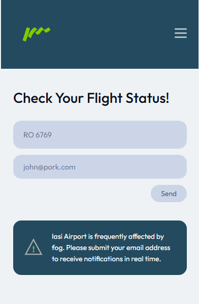
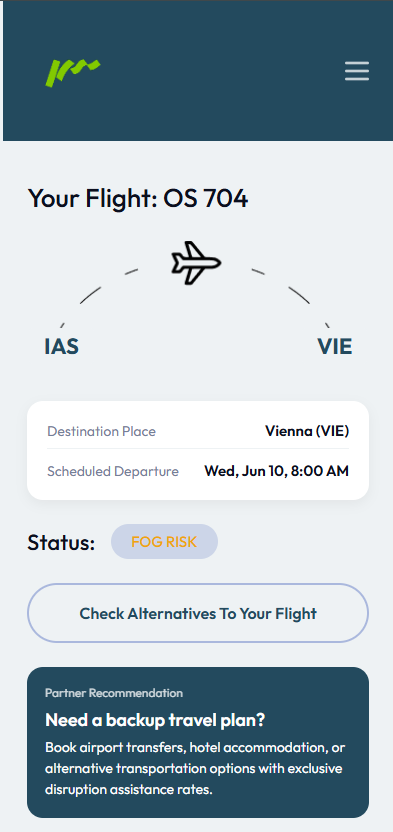
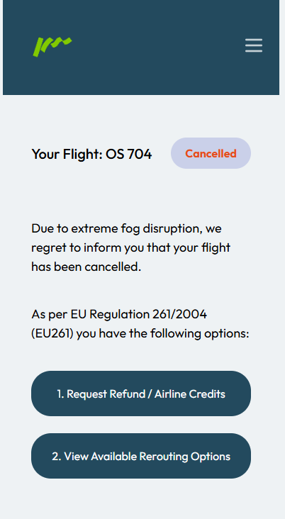
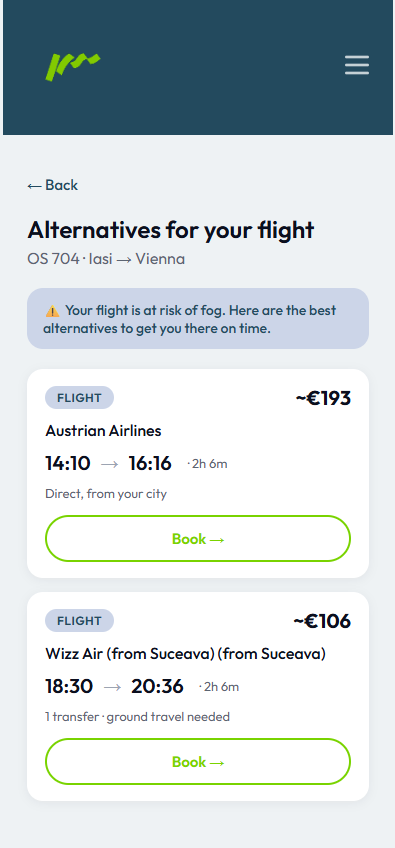
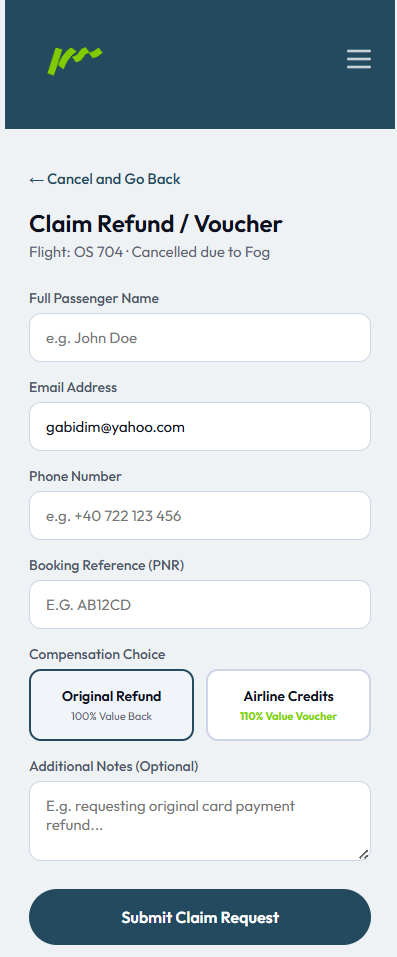
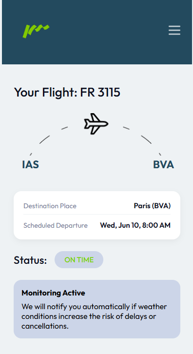

# Hecatron — Fog Copilot

> 🏆 Built at **[Air Hack Iași](https://fablabiasi.ro/air-hack-iasi/)** (Heckatron hackathon) for the **Passenger Flow Predictor** challenge.

Fog is the single biggest disruptor at Iași Airport (LRIA). During peak hours, gate closures trigger cascading delays, passengers miss connections, and staff allocation is purely reactive. **Hecatron** flips this: it predicts fog-related flight disruptions **2 and 6 hours in advance**, automatically alerts affected passengers by email, and surfaces ranked alternative transport options — so both passengers and airport staff can act before the problem escalates.

---

## Screenshots

| Home | Flight Status | Cancelled |
|------|--------------|-----------|
|  |  |  |

| Alternatives | Refund Claim | On Time |
|-------------|--------------|---------|
|  |  |  |

---

## What it does

1. **Predicts fog risk** at LRIA using a LightGBM model trained on historical METAR weather observations from Iași and three neighbouring airports. Outputs a calibrated probability (0–100%) and a tiered alert level (strong / soft / silent) for 2h and 6h horizons.
2. **Monitors flights** — passengers subscribe with their flight number and email. When fog risk crosses a threshold, they receive an automatic alert.
3. **Recommends alternatives** — rerouting engine queries real-time buses (FlixBus), CFR trains, and cached flights, ranks them by a latency-price-transfers score, and returns booking links.
4. **Supports EU 261/2004 refund claims** — passengers can submit refund requests directly through the app.

---

## Architecture

```
┌─────────────────────────────────────────────────────────────┐
│                 Frontend  (React + TypeScript + Vite)        │
│  Home → Flight Status → Cancelled → Alternatives → Refund   │
└───────────────────────┬─────────────────────────────────────┘
                        │ HTTP /api/*
┌───────────────────────▼─────────────────────────────────────┐
│            Rerouting API  (FastAPI :8000)                    │
│  flight lookup · rerouting · subscriptions · refund claims  │
└───────────┬───────────────────────┬─────────────────────────┘
            │ ML_API_URL (optional) │ DB (optional)
┌───────────▼──────────┐  ┌────────▼──────────────────────────┐
│  ML Service           │  │  Supabase (PostgreSQL)            │
│  (FastAPI :8001)      │  │  metar_raw · subscriptions        │
│  LightGBM fog model   │  │  refund_claims                    │
└──────────────────────┘  └───────────────────────────────────┘
            ▲
            │ METAR feed (every 15 min via GitHub Actions)
┌───────────┴──────────────────────────────────────────────────┐
│  Data Pipeline  (GitHub Actions)                              │
│  Aviation Weather Center → Supabase                          │
│  Model retrain: weekly (Monday 03:00 UTC)                    │
└───────────────────────────────────────────────────────────────┘
```

**Demo mode** — the app runs fully without Supabase or the ML service. Flight lookups and rerouting work offline via a built-in flight database.

---

## Tech stack

| Layer | Technology |
|-------|------------|
| Frontend | React 18, TypeScript, Vite |
| Rerouting API | Python 3.12+, FastAPI, Uvicorn |
| ML service | LightGBM, scikit-learn, pandas, FastAPI |
| Database | Supabase (PostgreSQL) |
| Email alerts | Resend |
| MLOps | GitHub Actions (ingest every 15 min, retrain weekly) |
| Hosting | Render (backend) + Vercel (frontend) |

---

## ML Pipeline

```
METAR ingest → feature engineering → time-series splits
    → LightGBM classifier (scale_pos_weight auto-computed)
    → isotonic calibration on validation set
    → conformal prediction intervals (split-conformal, α=0.20)
    → tiered alert decision engine (strong / soft / silent)
    → FastAPI inference endpoint (/predict, /nowcast)
```

**Features** (50+): visibility, humidity, dew-point depression, pressure tendency, wind speed/direction (circular encoding), lag features (1h/2h/3h/6h), rolling means, hourly/seasonal cyclical encoding, plus advection signals from three neighbouring stations (LRSV, LRBC, LUKK).

**Targets**: `fog_in_2h` and `fog_in_6h` — binary, `P(visibility < 1000 m)`.

**Baselines**: logistic regression + persistence model. LightGBM is compared against both on held-out test folds.

---

## How to run locally

### Prerequisites
- Python 3.12+ (standard CPython, not MSYS2/MinGW)
- Node.js 18+

### 1. Clone & configure environment

```bash
git clone https://github.com/callmenoob77/hecatron.git
cd hecatron
cp .env.example .env
# Leave .env blank for demo mode (no Supabase or ML service required).
# Fill in keys only if you want full functionality (see Environment Variables below).
```

### 2. Start the rerouting backend

```bash
# macOS/Linux
python3 -m venv venv
source venv/bin/activate
pip install -r rerouting/requirements.txt

# Windows (PowerShell)
py -3.12 -m venv venv
.\venv\Scripts\activate
pip install -r rerouting\requirements.txt

# Then start the server (from repo root, venv active):
cd rerouting
uvicorn api:app --reload --port 8000
# → http://127.0.0.1:8000
```

### 3. Start the frontend

```bash
cd frontend
npm install
npm run dev
# → http://localhost:5173
```

### 4. (Optional) Start the ML fog prediction service

```bash
cd ml
pip install -e ".[serve]"        # or: uv sync --extra serve
python train.py                  # requires Supabase METAR data (see Data Pipeline)
uvicorn app:app --port 8001
# → http://127.0.0.1:8001
```

The rerouting API automatically falls back to static flight status when the ML service is not running.

---

## Demo flights

| Flight | Route | Status |
|--------|-------|--------|
| `RO 6769` | Iași → Milano | FOG RISK |
| `OS 704` | Iași → Vienna | FOG RISK |
| `FR 3113` | Iași → Bergamo | FOG RISK |
| `RO 6771` | Iași → Londra | ON TIME |
| `RO 707` | Iași → București | ON TIME |

---

## API Reference

| Method | Endpoint | Description |
|--------|----------|-------------|
| `GET` | `/health` | Health check |
| `GET` | `/flight/{flight_number}` | Flight details + fog risk status |
| `POST` | `/subscribe` | Register email for fog alerts |
| `POST` | `/refund` | Submit EU 261/2004 refund claim |
| `POST` | `/reroute` | Get ranked alternative transport options |

**Rerouting score** (lower = better):
```
score = 1.0 × arrival_lateness_hours + 0.05 × price_eur + 1.5 × transfers
```

Transport adapters: FlixBus (real-time), CFR trains (static timetable), Google Flights (7-day cache). Adapter failures are silently skipped.

---

## Data Pipeline

METAR observations are fetched from [Aviation Weather Center](https://aviationweather.gov/api/data/metar) and stored in Supabase.

```bash
# One-time backfill (requires SUPABASE_CONN_STRING in .env)
python data-pipeline/backfill_metar.py

# Init DB tables
python data-pipeline/create_subscriptions_table.py
python data-pipeline/create_refunds_table.py
```

GitHub Actions automates everything in production:
- **`ingest.yml`** — runs every 15 minutes, ingests latest METAR, triggers ML prediction
- **`train_model.yml`** — runs every Monday at 03:00 UTC, retrains the model and commits updated artifacts

---

## Deploy to Render + Vercel

### Backend (Render)
1. Push the repo to GitHub
2. Create a new Render Web Service — `render.yaml` is auto-detected
3. Set environment variables in the Render dashboard (see below)

### Frontend (Vercel)
- Build command: `npm run build`
- Output directory: `dist`
- Set `VITE_API_BASE` to your Render backend URL

---

## Environment Variables

| Variable | Required | Description |
|----------|----------|-------------|
| `SUPABASE_CONN_STRING` | No | PostgreSQL connection string for Supabase |
| `SUPABASE_URL` | No | Supabase project URL (email notifications) |
| `SUPABASE_KEY` | No | Supabase anon/service key |
| `RESEND_API_KEY` | No | [Resend](https://resend.com) key for email alerts |
| `ML_API_URL` | No | URL of the ML service (default: `http://localhost:8001`) |
| `ALLOWED_ORIGINS` | No | Comma-separated CORS origins for the backend |
| `VITE_API_BASE` | No (frontend) | Backend URL used by the React app |

All variables are optional for local demo mode.

---

## Project Structure

```
hecatron/
├── frontend/          # React + TypeScript UI
│   └── src/screens/   # 5 screens: home, status, cancelled, alternatives, refund
├── rerouting/         # FastAPI rerouting API + transport adapters
├── ml/                # ML fog prediction service
│   ├── src/           # ingest · features · splits · model · conformal · decision
│   ├── train.py       # training entry point
│   ├── app.py         # FastAPI inference service (live METAR enrichment)
│   └── models/        # serialised LightGBM model artifacts
├── data-pipeline/     # METAR ingestion scripts + DB schema
└── .github/workflows/ # MLOps automation (ingest + retrain)
```

---

## License

MIT — see [LICENSE](LICENSE).
